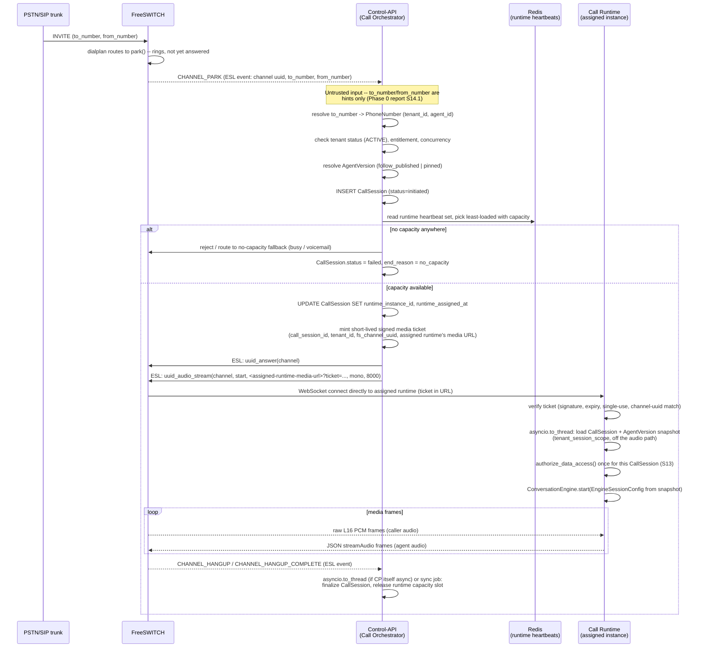
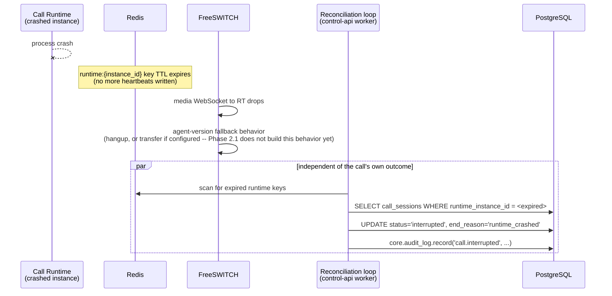

# Phase 2.0 — Architecture Research & Decisions

**Phase**: 2.0 — research and decisions only. No implementation.
**Date**: 2026-09-21.
**SaaS-OS pin** (unchanged, verified): `ff550010e5eafecace7311038aadc99fcecfbe3d`.

This report resolves the two blockers Phase 0 left open for Phase 2 (OD-3:
initial AI provider architecture; OD-5: FreeSWITCH topology) and produces the
exact implementation contract Phase 2.1 builds from. It changes no code,
creates no migration, adds no dependency, and does not touch SaaS-OS.

---

## 1. Objective

Produce a precise, implementable architecture and decision package for
Phase 2.1 — the first slice that gives the platform an actual `Agent`,
`AgentVersion`, `PhoneNumber` and `CallSession`, with a resolved provider
strategy and a resolved runtime topology behind them — such that Phase 2.1 can
be implemented without another architectural decision along the way.

## 2. Scope

In scope: OD-3 and OD-5 resolution; the control-plane/runtime-plane boundary;
the call lifecycle and ownership model; the `AgentVersion` snapshot model;
the provider-credential boundary; the media contract; the tool-invocation
boundary; the privacy-authorization point; the Phase 2.1 domain model, RLS
model, concurrency model, and failure/recovery model; scaling and
observability requirements; and the exact Phase 2.1 implementation contract.

Out of scope, explicitly (§19 restates this): implementing any of the above —
no application code, no migration, no SDK, no FreeSWITCH adapter, no engine,
no Tool Gateway, no Contacts/Calendar/Workflow code. Where this report
specifies exact tables and columns (§23), that specification *is* the
deliverable — writing the migration that creates them is Phase 2.1's job, not
this phase's.

## 3. Existing constraints (carried forward, unmodified)

Everything Phase 0/0.1/1 established is binding and is not relitigated here
except where §5 and §20 note an explicit clarification:

- **ADR-0001** — SaaS-OS is a pinned Git dependency at an exact commit SHA,
  never forked, copied, vendored, or modified. The pin verified for this phase
  (`git rev-parse HEAD` against the local `saas-os` checkout, and the
  installed `direct_url.json` from Phase 1's own venv) is
  `ff550010e5eafecace7311038aadc99fcecfbe3d` — unchanged.
- **ADR-0002** (+ 2026-09-21 amendment) — FreeSWITCH is the single telephony
  core, behind product-owned `TelephonyProvider`/`MediaProvider` contracts,
  confined to `voiceagent.telephony.freeswitch`.
- **ADR-0003** — every agent action is mediated by a product-owned Tool
  Gateway, never `control_plane.orchestration.invoke_tool()` on the realtime
  path.
- **ADR-0004** — `AgentVersion` rows are immutable once published; a call
  executes against one version, resolved once at call start.
- **ADR-0005** — package `voiceagent`, schema `app` (frozen), API `/v1/...`.
- **ADR-0006** — `ConversationEngine` is product-owned and framework-free;
  Pipecat, if used, is confined to `voiceagent.providers.engines.pipecat` and
  is never a hard dependency.
- **ADR-0007** — application code never imports `sqlalchemy`/`psycopg`
  directly, never reaches `text`/`func`; only `voiceagent.db` is imported for
  persistence; migrations own physical PostgreSQL types; `target_metadata =
  None`; `create_all()` is never called.
- **Phase 1 foundation** — `voiceagent/` package structure, `voiceagent.db`
  seam, `voiceagent.tenancy.TenantContext`, `voiceagent.api.build_app()`,
  the `TelephonyProvider`/`MediaProvider`/`ConversationEngine` contracts and
  fakes, three enforced import-linter/AST fences, 78 passing tests, CI. All
  reused, none rebuilt.

This phase adds two ADRs — **ADR-0008** (call runtime topology, resolves
OD-5) and **ADR-0009** (initial AI provider strategy, resolves OD-3) — and
does not rewrite ADR-0001 through ADR-0007.

---

## 4. OD-3 — Initial AI provider architecture

### 4.1 Method

Documented capabilities were checked against official provider documentation
and pricing pages (full citation list in §22, each with the date checked:
2026-09-21). No architectural conclusion below is based on a blog post or a
provider's own marketing copy alone.

### 4.2 Comparison

| Dimension | OpenAI Realtime (`gpt-realtime`) | ElevenLabs Agents | Deepgram Nova-3 (STT only) |
|---|---|---|---|
| Architecture | True duplex speech-to-speech, one WebSocket session | Orchestrated session: ElevenLabs-run STT + customer-chosen LLM + ElevenLabs TTS + proprietary turn-taking, behind one session API | Streaming STT only, composable |
| Streaming in/out | Yes, native | Yes, native (as a session) | Streaming input, partial + final transcripts out |
| Interruption/barge-in | Server-side VAD, native | Native turn-taking model, documented | N/A (STT has no output to interrupt) |
| Partial transcripts | N/A (no separate transcript surface by default) | Not itself exposed as a raw partial-transcript API | Yes, native |
| Tool/function calling | Native | Native | N/A |
| Structured outputs | Via function-calling schema | Via function-calling schema | N/A |
| Telephony audio compatibility | Native `g711_ulaw`/`g711_alaw` output option (8 kHz) alongside PCM16 24 kHz; **no resampling adapter needed for the telephony leg on output** | Documented native telephony integration incl. Twilio; exact wire format not independently verified against source in this phase | Accepts streaming PCM; exact codec/sample-rate matrix not fully enumerated in this phase's research |
| WebSocket/WebRTC | WebSocket (Realtime API) | WebSocket-based session | WebSocket streaming |
| Session lifecycle | One session per call, explicit start/stop | One session per call, explicit start/stop | One stream per utterance-window, no persistent "session" concept |
| Connection recovery | Adapter's responsibility; no documented built-in resume | Adapter's responsibility | Adapter's responsibility |
| Provider-side state | Yes — the model's conversational context lives in the session | Yes — the whole orchestration's state lives in the session | No — stateless per stream |
| Authentication | API key | API key (per-agent config in ElevenLabs' own platform, or raw API) | API key |
| Tenant-specific credentials | Fits the ADR-0007/§7 boundary — deployment key vs. future tenant key, no different from any other provider | Same | Same |
| Dutch language support | General multilingual (model-level, not separately enumerated for Realtime specifically in what was checked) | Explicitly listed | Explicitly listed |
| Arabic (MSA) support | General multilingual | Explicitly listed (30+ languages) | Explicitly listed (45+ languages) |
| Darija (Moroccan Arabic) | **Not documented by any provider researched** — see §4.4 | Not documented | Not documented |
| Pricing model | Per-token (audio tokens: ~600 input / ~1,200 output tokens per minute of speech at the flagship tier); documented per-minute cost band roughly $0.02–$0.46/min depending on caching and model tier | Not independently re-derived in this phase beyond confirming a per-request Zero Retention toggle exists; pricing page exists but was not the focus of this research pass | ~$0.0048–$0.0077/min streaming (list price, promotional pricing observed at time of check) |
| Rate/concurrency limits | Account-tier dependent; not itself the deciding factor here | Account-tier dependent | Account-tier dependent |
| Data/privacy — training | Enterprise API data not used for training by default; opt-in required otherwise | Enterprise accounts do not train by default; non-enterprise can opt out via account settings | Not independently checked in this phase |
| Data/privacy — retention | 30-day default retention; **Zero Data Retention available to eligible API customers** | **Zero Retention Mode available per-request** (`enable_logging=false`) for TTS/STT/Agents specifically | Not independently checked in this phase |
| Swappable behind product contracts | Yes — as a `RealtimeEngine` adapter, confined below the contract | Yes, but only if confined to an adapter and never allowed to shape the contract itself (ADR-0009 point 6) | Yes — as an `SttProvider` adapter |

### 4.3 Recommendation

Resolved formally in **ADR-0009**. Summary:

1. **The first implementation vertical slice is `PipelinedEngine`**, not
   `RealtimeEngine` — its three surfaces are independently swappable and
   individually cheap to integration-test, which is what a first slice should
   stress the `ConversationEngine` contract against.
2. **Development/integration-testing providers** for that slice: an STT
   provider matching Deepgram's documented streaming shape, an LLM provider
   satisfying the already-defined `LlmProvider` contract (deliberately
   unnamed — see ADR-0009 point 3), and a TTS provider matching ElevenLabs'
   documented streaming-synthesis shape used strictly through the
   `TtsProvider` contract, never through ElevenLabs Agents' own orchestrated
   session.
3. **`RealtimeEngine`'s first candidate**, when it is built (Phase 2.2+), is
   **OpenAI Realtime** — chosen specifically for its native `g711_ulaw`
   telephony-encoded output and documented Zero Data Retention eligibility,
   not for latency or price alone.
4. **The provider that must NOT become a hard architectural dependency**:
   **ElevenLabs Agents**, specifically because its orchestrated-session shape
   is the one most likely to leak into `ConversationEngine`'s abstraction if
   adopted carelessly. It remains eligible as a *second* `RealtimeEngine`
   candidate once the contract has already been proven against a more
   primitive session (OpenAI Realtime).

### 4.4 The unresolved risk: Darija

No provider researched documents Moroccan Arabic (Darija) as a distinct,
evaluated language — every vendor's language list names "Arabic" as one
entry, with no published dialect-specific accuracy figures. SaaS-OS's own
ADR-0015 names MarocAssist and AuraVox as example consuming projects, which
makes this a live product risk, not a hypothetical one. It cannot be resolved
by more documentation research — it requires evaluating each STT candidate
against real Darija audio samples before any Moroccan-market commitment.
Recorded as **open question OQ-3** (§20), owned by whoever picks up that
market, not blocking the Phase 2.1 vertical slice described above (which
targets English/Dutch/MSA-class languages first).

---

## 5. OD-5 — FreeSWITCH topology

Resolved formally in **ADR-0008**. This section carries the sequence diagram
and the concrete answers the brief's checklist asked for.

### 5.1 Sequence — inbound call



### 5.2 Sequence — runtime crash mid-call (recovery, not resumption)



### 5.3 Direct answers

| Question | Answer |
|---|---|
| How are inbound calls identified? | By the FreeSWITCH channel UUID (opaque, carried as `call_sessions.fs_channel_uuid`), established at `CHANNEL_PARK` |
| How is the tenant identified? | Server-side resolution of the *called* number (`to_number`) against `phone_numbers.e164`, never from caller ID and never from any client-supplied value (Phase 0 §14.1, unchanged) |
| How does the called number map to a tenant? | `phone_numbers.e164` (globally unique, §9) → `phone_numbers.tenant_id` |
| When is `CallSession` created? | At `CHANNEL_PARK`, after tenant/agent resolution, before answer and before media attachment |
| When is an Agent/AgentVersion selected? | In the same step: `phone_numbers.agent_id` plus the number's `version_pin_mode` resolve one `agent_version_id`, written onto the new `CallSession` row and never re-read for the life of the call (ADR-0004) |
| How is the call assigned to a runtime process? | Least-loaded selection over the Redis heartbeat set (ADR-0008 point 5), written onto `call_sessions.runtime_instance_id` |
| How does FreeSWITCH know where to send media? | The ESL `uuid_audio_stream start` command is issued with the *assigned* runtime's own media URL, learned from that runtime's heartbeat record — not a fixed, shared endpoint |
| How is the media connection authenticated? | A short-lived, signed, single-use ticket minted by the Call Orchestrator at assignment time, verified by the runtime on connect (Phase 0 §14.3, unchanged) |
| How is the correct runtime process selected? | ADR-0008 point 5: least-loaded with capacity below its configured ceiling |
| How is call ownership tracked? | `call_sessions.runtime_instance_id` — exclusive by construction (ADR-0008 point 10), not by a runtime-side lock |
| How does the runtime survive transient provider failures? | §17 (failure/recovery model) — per-dependency, not uniform |
| How are hangup/transfer/bridge events propagated? | Normalized `CallEvent`s over the `TelephonyProvider.events()` stream (already defined in `voiceagent/telephony/contracts.py`), consumed by whichever process holds the ESL connection for that call |
| What happens when a runtime process crashes? | ADR-0008 points 9 and 11: the call itself ends (no session takeover); bookkeeping is repaired by heartbeat-expiry detection and the reconciliation loop |
| How is a stale runtime assignment detected? | Redis heartbeat TTL expiry, read by the reconciliation loop (ADR-0008 point 11) |
| How is a parked channel recovered/reaped? | Unchanged from ADR-0002 §10.6 — the parked-channel reaper, a distinct mechanism from runtime-crash reconciliation, though both live in the same reconciliation loop process |
| How are concurrent calls distributed? | Least-loaded runtime selection (ADR-0008 point 5) |
| How does horizontal scaling work? | Add `call-runtime` processes; each registers its own heartbeat and accepts assignments independently (ADR-0008 point 6) |
| How is backpressure handled? | Capacity refusal at assignment time, never silent queuing on the audio path (ADR-0008 points 13–14) |
| What happens when no runtime capacity exists? | A defined "no capacity" outcome routes to the agent version's configured fallback for inbound, or a synchronous failure for outbound (ADR-0008 point 14) |

### 5.4 Which process holds the inbound ESL connection

Two shapes are possible and this report recommends one, while leaving the
alternative explicitly open (ADR-0008's own "What Is Deliberately Not Decided
Here"):

- **Recommended for Phase 2.1**: `control-api`'s own worker process holds the
  ESL connection(s) used for *inbound resolution* (`CHANNEL_PARK` → tenant/
  agent/runtime resolution → `uuid_answer`/`uuid_audio_stream`). Each
  `call-runtime` process holds its *own* ESL connection only for the commands
  it issues against calls it already owns (hold, DTMF, transfer, hangup,
  recording control) — it never resolves a *new* inbound call itself. This
  keeps "who decides which tenant a call belongs to" in exactly one place
  (the control plane, which already does authorization and audit), and keeps
  a `call-runtime` process's ESL usage narrowly scoped to calls it has already
  been assigned.
- **Alternative** (not chosen, not foreclosed): every `call-runtime` process
  holds an inbound-capable ESL connection and races to claim a parked channel.
  Rejected for Phase 2.1 because it duplicates the tenant/agent resolution
  logic's trust boundary across every runtime process for no capacity benefit
  at this scale — the resolution step is cheap and does not need to be
  distributed.

---

## 6. Control plane vs call runtime

### 6.1 The boundary

| | Control/API plane (`control-api`) | Call runtime plane (`call-runtime`) |
|---|---|---|
| Owns | Tenants, agents, agent versions, phone numbers, configuration, contacts, calendar, tools (config), workflows, call *metadata*, permissions, audit, billing integration | Active call state, media frames, STT/LLM/TTS/realtime streaming, interruption/barge-in, tool-invocation *requests*, call lifecycle events, latency-sensitive state |
| Database access | Synchronous, direct (`voiceagent.db` / `infra.db.tenant_session_scope`) — this is the process where synchronous DB access is native and unproblematic | Only via `asyncio.to_thread()`, only at call-start/tool-boundary/call-end — **never on the audio path** (ADR-0008 point 2, unchanged from Phase 0 §4.2) |
| Process model | Ordinary request/response FastAPI process (`voiceagent.api.build_app()`), already built in Phase 1 | New in Phase 2: `asyncio` event loop, N concurrent `EngineSession`s (ADR-0008 point 1) |
| Holds ESL for | Inbound call resolution (§5.4) | Commands against calls it already owns |
| Holds media socket | Never | Yes — the `MediaProvider` attachment lives here |

### 6.2 What may cross the boundary

Only three kinds of thing cross from control plane to runtime plane, all at
call-start:

1. **The `call_session_id`** and the **signed media ticket** — the runtime's
   only inputs; everything else it needs, it loads itself (from its own
   `asyncio.to_thread` DB read, verified by re-checking the ticket).
2. **Tool-call *requests***, in the other direction: the runtime asks the
   control plane's Tool Gateway to execute a tool (ADR-0003) — this is the
   one legitimate, expected runtime→control-plane call during a live call,
   and it is itself off the audio-processing critical path (the engine awaits
   the result asynchronously while continuing to process audio in other
   tasks, per the `ToolCallRequested`/`ToolResult` contract already defined).
3. **Lifecycle events**, from FreeSWITCH into whichever process is watching
   for them at that moment (control plane for pre-assignment events, runtime
   for post-assignment events it owns) — never database rows shared by direct
   query across the boundary; each process persists what it observes through
   its own sanctioned path.

**Never crosses the boundary**: a raw SQLAlchemy session, a `TenantContext`
constructed anywhere but the process that verified it, an unvalidated model
tool-call argument, or a provider credential (see §10).

### 6.3 Process model decision

Resolved in ADR-0008 point 1: **one process, one `asyncio` event loop, many
concurrent calls per process; horizontal scaling by adding processes.**
Neither one-process-per-call (cost) nor a single unscalable process (ceiling)
nor session-replicated hot takeover (unjustified complexity at this scale —
recorded as a Phase 3+ candidate).

---

## 7. Call lifecycle

```text
incoming call (PSTN/SIP)
    |
tenant resolution (called-number lookup, server-side, untrusted input)
    |
CallSession creation (control-api, before answer)
    |
Agent selection (phone_numbers.agent_id)
    |
AgentVersion snapshot resolution (follow_published | pinned; resolved once)
    |
runtime assignment (least-loaded, Redis heartbeat set; may fail -> no_capacity)
    |
media attachment (signed ticket; FreeSWITCH -> assigned runtime directly)
    |
data-access authorization (authorize_data_access(), once per CallSession)
    |
conversation (ConversationEngine session; Phase 2.2+, not built in 2.1)
    |
tools/workflows (Tool Gateway; Phase 2.2+, not built in 2.1)
    |
transfer / hangup / completion (normalized CallEvent -> CallSession finalized)
```

Phase 2.1 implements everything through "media attachment" as a *schema and
resolution-logic* deliverable (the tables and the pure resolution functions
described in §23) without wiring an actual FreeSWITCH adapter or engine to
it — consistent with §19's scope boundary. "Conversation" and "tools/
workflows" are Phase 2.2+.

---

## 8. Call ownership model — authoritative identifiers

| Identifier | Authoritative? | Persisted? | Where it lives |
|---|---|---|---|
| `tenant_id` | Yes — the single tenant-isolation key | Yes | Every product table (§9) |
| `phone_number_id` | Yes — the routing key that resolved the call | Yes | `call_sessions.phone_number_id` |
| `call_session_id` | Yes — the call's own identity from creation onward | Yes | `call_sessions.id`; also the correlation id for every log/trace/tool-call touching this call |
| `agent_id` | Yes, but see `agent_version_id` — the pointer, not the behavior | Yes | `call_sessions.agent_id` |
| `agent_version_id` | **The** authoritative behavior key (ADR-0004) — resolved once, never re-read | Yes | `call_sessions.agent_version_id` |
| Runtime instance ID | Authoritative for *current ownership* only, not for history | Yes, but **overwritable, not versioned** — Phase 2.1 does not keep a reassignment history (ADR-0008 point 12: no mid-call reassignment happens at all) | `call_sessions.runtime_instance_id` |
| Provider call/channel ID (FreeSWITCH channel UUID) | Authoritative for correlating ESL events to this call | Yes, opaque | `call_sessions.fs_channel_uuid` |
| Conversation ID | Deferred — no `conversations` table in Phase 2.1 (§9.2) | N/A yet | N/A |

Nothing here is runtime-only that also needs to be authoritative: every
identifier that matters for *ownership* (as opposed to *in-flight engine
state*, §17's "runtime-only state") is a `call_sessions` column, precisely so
that ownership can be determined by reading one row, not by asking a live
process.

---

## 9. AgentVersion snapshot model

### 9.1 What must be captured

Per §6 of the task brief, evaluated against what Phase 2.1's own scope
actually needs to prove (agent lifecycle + call resolution, not a working
engine yet):

| Field | Included in Phase 2.1's `config` schema? | Why |
|---|---|---|
| System instructions | Yes | Core of the agent |
| Greeting | Yes | Core of the agent |
| Language | Yes | Drives voice/STT/TTS selection later |
| Voice reference | Yes (`{provider, voice_id, settings}`) — a reference, never an inlined vendor value (Phase 0 §11.3, unchanged) | |
| STT/LLM/TTS/realtime provider + config | Yes, as a nested `engine` object — captured now even though nothing resolves it until Phase 2.2, because it is exactly the kind of field a draft edit could change out from under a running call if it were *not* snapshotted from day one | |
| Tool bindings | Yes, as a list of `{key, config}` | Config only — never a credential (§10) |
| Workflow bindings | Yes, nullable (`null` = prompt-only agent, Phase 0 §3.5's "no-workflow happy path") | |
| Transfer/escalation settings | Yes | |
| Recording settings | Yes (`enabled`, `announce`) | |
| Privacy settings | Yes (`data_classification`, `purpose` — the exact fields `DataAuthorizationRequest` needs, §13) | |
| Model parameters | Yes, inside `engine.llm.config` | |

### 9.2 The shape: immutable JSON snapshot, not normalized child tables

**Decision: a single JSON `config` column on `agent_versions`, not normalized
child tables.** Rationale:

- The entire point of an `AgentVersion` is that it is read and applied
  *atomically* at call start — one row, one read, one immutable value.
  Normalizing into child tables (an `agent_version_tools` join table, an
  `agent_version_transfer_rules` table, ...) would mean call-start assembly
  requires multiple joined reads, each individually needing the same
  immutability guarantee, for a property JSON already gives for free.
- ADR-0007's persistence boundary already treats `JSON` as the sanctioned,
  exported primitive; there is no `ARRAY`/`JSONB`-shaped need here that would
  push toward a different physical type.
- `config_hash` (SHA-256 over a canonical serialization) remains a single,
  simple value to compute and compare, which a normalized model would not
  simplify.
- The published-row immutability trigger (§23) is one `BEFORE UPDATE` rule on
  one table; normalizing would require the same rule replicated across every
  child table, or a more complex trigger reasoning about joined state.

This is a **hybrid** only in the narrow sense that `tools` and `workflow`
inside the JSON reference *other* tables' primary keys by id (a tool's `key`
names a Tool Gateway–registered tool, not a row in a product table in
Phase 2.1) — not in the sense of splitting the snapshot itself across tables.

### 9.3 `config` schema (documentation, not a DB schema — validated at
publish time by application code, not by a Postgres `CHECK`)

```json
{
  "instructions": "string",
  "greeting": "string | null",
  "language": "bcp47 string, e.g. \"en\", \"nl\", \"ar\"",
  "voice": { "provider": "string", "voice_id": "string", "settings": {} },
  "engine": {
    "kind": "pipelined | realtime",
    "stt": { "provider": "string", "config": {} },
    "llm": { "provider": "string", "model": "string", "config": {} },
    "tts": { "provider": "string", "config": {} },
    "realtime": { "provider": "string", "config": {} }
  },
  "tools": [ { "key": "string", "config": {} } ],
  "workflow": null,
  "transfer_rules": [ { "condition": {}, "destination_e164": "string", "fallback": {} } ],
  "business_hours": { "timezone": "IANA string", "windows": [] },
  "call_limits": { "max_duration_seconds": 0, "max_turns": 0, "max_tool_calls": 0 },
  "recording": { "enabled": false, "announce": false },
  "privacy": { "data_classification": "string", "purpose": "string" }
}
```

### 9.4 Snapshot vs. runtime-facing config — an explicit clarification

`agent_versions.config` (above) is the **full, stored source of truth**. The
`EngineSessionConfig` already defined in
`voiceagent/providers/engines/contracts.py` is **narrower by design** — it
carries only what an `EngineSession` itself needs (`instructions`, `greeting`,
`language`, `voice`, `tools`). The Call Orchestrator derives one from the
other at call start; `EngineSessionConfig` is never persisted and is not
where transfer rules, business hours, call limits, recording or privacy
settings live — those stay on the full snapshot and are consumed directly by
the Call Orchestrator and the Tool Gateway, not passed through the engine.
This is why `EngineSessionConfig` does not need to grow every time a new
agent-level setting is added.

### 9.5 Enforcement (unchanged from ADR-0004, restated precisely for
Phase 2.1's migration)

Three layers, exactly as ADR-0004 specifies: application (no update path to a
published row exists), database (a `BEFORE UPDATE` trigger, exact SQL in
§23), runtime (the snapshot loads once into memory for the call's life — a
Phase 2.2+ property, since no runtime reads it yet in Phase 2.1).

---

## 10. Provider credential boundary

### 10.1 The three levels

| Level | What lives here | Where | Phase 2.1? |
|---|---|---|---|
| **Deployment-level** | Platform operator's own default provider credentials (if any exist at all — e.g. a shared development STT key) | `infra.secrets.SecretsProvider`, read by the adapter process at startup — never product configuration, never a database row | Not built in Phase 2.1 (no adapter exists yet); the boundary is documented now so no later design pushes a deployment secret into a tenant-facing table |
| **Tenant-level** | A tenant's own provider credentials (e.g. their own ElevenLabs/OpenAI account) | A product-owned, encrypted row — see §10.2 | **Not built in Phase 2.1** — deferred (§11); the encryption pattern is specified now so the eventual table needs no redesign |
| **Agent-level** | *Selection*, never a secret: which provider/model an agent version uses (`config.engine.stt.provider`, etc.) | Inside the `AgentVersion.config` JSON (§9.3) | Yes — the schema already reserves the field |

### 10.2 Where an encrypted tenant credential would live (specified now,
not built in Phase 2.1)

A future `provider_credentials` table (§11, deferred): `tenant_id`,
`provider` (string key, e.g. `"elevenlabs"`), `secret_ciphertext` (the output
of `core.crypto.EncryptionService.encrypt_str()`), `key_version` (implicit in
the envelope format itself, per `core/crypto/envelope.py`'s own `efv1:
<key_version>:<nonce>:<ciphertext_and_tag>` shape — **no separate column
needed**, ADR-0007's minimalism principle applied to credential storage too).
Encryption/decryption always binds `tenant_id` as `associated_data` (bytes),
so a ciphertext copied into another tenant's row fails to decrypt rather than
silently decrypting under the wrong context — this is the exact mechanism
Phase 0 §2.4 G-3 specified and is unchanged here; no new SaaS-OS capability is
needed, `core.crypto` already provides it.

### 10.3 Hard rules (all unchanged from the brief, restated as binding)

- A deployment-global credential must never be read from a tenant/provider
  settings row — it is deployment configuration only, sourced through
  `infra.secrets`.
- A secret is **never** part of `AgentVersion.config` — that field stores
  `provider`/`model`/`config` *selectors*, never a key. A publish-time
  validator (Phase 2.2+, not built now) should reject any `config` payload
  containing a key matching common secret-shaped field names, as a defense in
  depth alongside the schema simply not defining one.
- A secret is never exposed to the model: the `LlmProvider`/`SttProvider`/
  `TtsProvider` adapters resolve credentials themselves, entirely below the
  `ConversationEngine` contract; nothing about a credential ever appears in a
  prompt, a tool schema, or a `ToolResult`.
- A secret is never persisted in `ConversationTurn`/transcript content (not
  built in Phase 2.1, but the constraint is recorded now so it is never
  retrofitted).
- A secret is never returned through an API response — a future
  `provider_credentials` read endpoint (Phase 2.2+) returns metadata
  (`provider`, `created_at`, a masked identifier) and never `secret_ciphertext`
  or any decrypted value.

---

## 11. Phase 2.1 domain model

### 11.1 Phase 2.1 — build now (schema + resolution logic; §23 for exact DDL)

`agents`, `agent_versions`, `phone_numbers`, `call_sessions`.

### 11.2 Deferred, with reasons

| Table | Deferred to | Why |
|---|---|---|
| `conversations` | Phase 2.2 (first engine work) | Nothing populates it until an engine exists; creating an all-null row today buys nothing an idempotent `INSERT` at Phase 2.2 wouldn't, and a table with no writer is exactly the kind of ahead-of-need artifact this platform's own conventions reject |
| `conversation_turns` | Phase 2.2+ | Same reason, one level further from Phase 2.1's actual deliverable |
| `contacts`, `contact_phones` | Phase 3 (native Contacts, Phase 0 §12) | No caller-resolution feature exists yet to populate them |
| `calendars`, `working_hours`, `appointments` | Phase 3 (native Calendar, Phase 0 §13) | Same |
| `tools` (per-tenant enablement rows) | Phase 2.2/2.3, alongside the Tool Gateway (ADR-0003) | A config row with no Gateway to consult it is dead weight |
| `tool_bindings` | Same as `tools` | Modeled as part of `AgentVersion.config.tools` (§9.3) until a normalized table earns its keep |
| `workflows`, `workflow_versions` | Phase 3 (workflow model, Phase 0 §9) | `AgentVersion.config.workflow` already reserves the field; no separate versioning system needed while workflows are optional and secondary (Phase 0 §3.5, §9.1) |
| `recordings` | Phase 2.2+ alongside actual recording capture | Nothing to point at yet |
| `provider_credentials` | Phase 2.2+ (§10) | No adapter exists yet to consume one |
| `runtime_assignment` (as its own table) | **Never, by design** — folded into `call_sessions.runtime_instance_id`/`runtime_assigned_at` (ADR-0008) | A call has exactly one current runtime, no reassignment happens mid-call, and no history is kept — two columns are the minimal durable model; a separate table would imply a history this design deliberately does not keep |

### 11.3 Relationships (Phase 2.1 tables only)

```text
core.tenants (SaaS-OS, read-only reference)
    |
    +-- app.agents (tenant_id)
    |       |
    |       +-- app.agent_versions (agent_id, tenant_id)  [append-only]
    |               ^
    |               |  draft_version_id / published_version_id (agents -> agent_versions,
    |               |  added via ALTER TABLE after both tables exist -- see S23)
    |
    +-- app.phone_numbers (tenant_id, agent_id -> agents, pinned_version_id -> agent_versions)
    |
    +-- app.call_sessions (tenant_id, phone_number_id, agent_id, agent_version_id)
```

### 11.4 Ownership boundaries

Every Phase 2.1 table is **product-owned**, created by the product's own
Alembic history (`migrations/`, ADR-0007), in schema `app`. None modifies a
SaaS-OS schema. `agent_versions.published_by` and any future "actor" column
reference `core.identity.User` ids **by value only, with no FK constraint**
(§11.5) — SaaS-OS owns that identity and its own erasure path; the product
never adds a foreign key that could block or complicate an erasure it does
not own.

### 11.5 A specific finding worth flagging: no FK into `core.users`

`agent_versions.published_by` (and any future `created_by`/`actor_id`-shaped
column) is a plain `UUID`, not a foreign key into `core.users(id)`. Reasoning:
SaaS-OS's `core.identity` module provides individual identity erasure
(`core/identity/erasure.py`), and its own ADR posture is that this capability
is deliberately not exposed to Products/API. A product-side FK into
`core.users` would create a referential-integrity dependency on rows the
product does not own the lifecycle of — an erasure could then be blocked by a
product table SaaS-OS's own erasure path knows nothing about. The value is
still meaningful (resolved via `core.identity.get_user()` at read time, best
effort); it is simply not enforced at the database level. This is a durable
pattern, not a one-off: it applies to every future "who did this" column the
product adds.

### 11.6 Immutable vs. mutable entities, and lifecycle states

| Table | Mutable? | Lifecycle states |
|---|---|---|
| `agents` | Mutable (name, description, draft/published pointers, status) | `active`, `archived` |
| `agent_versions` | **Immutable once `published`** (DB-enforced, §23) | `draft` → `published` → `archived` |
| `phone_numbers` | Mutable | not state-machined in Phase 2.1 beyond `inbound_enabled` |
| `call_sessions` | Mutable during the call, append-only in effect afterward (nothing updates a `completed`/`failed`/`interrupted` row — enforced by application discipline in Phase 2.1, not yet a DB trigger, since no runtime writes to it yet) | `initiated` → `ringing` → `answered` → `in_progress` → (`completed` \| `failed` \| `interrupted`) |

---

## 12. Media contract

Already defined in Phase 1's `voiceagent/telephony/contracts.py` and
restated here as the canonical reference, with the physical defaults this
phase confirms:

- **Sample rate**: 8,000 Hz default (`AudioFormat(sample_rate=8000)`) — the
  realistic PSTN leg; 16,000 Hz is the one additional format the contract
  already enumerates (`FakeMediaProvider.FORMATS`), for a wideband path if a
  future trunk offers it.
- **Encoding**: `pcm_s16le` — 16-bit signed linear PCM, little-endian.
- **Channels**: mono (1).
- **Frame duration**: not fixed by the contract itself (`MediaStream.send`/
  `receive` operate on opaque `bytes` frames); `mod_audio_stream`'s own
  observed cadence is 20 ms per frame (confirmed against the Dograh
  FreeSWITCH adapter's own source, `serializers.py`, itself verified against
  the module's C++ source per that adapter's `DESIGN.md` — Phase 0 §10.4).
  The product contract does not encode this number because it is a transport
  detail belonging to `voiceagent.telephony.freeswitch`, not to
  `MediaProvider`'s interface.
- **Direction**: `MediaStream.send()` (product → caller) and
  `MediaStream.receive()` (caller → product) are independent, both
  bidirectional-capable at the contract level.
- **Timestamps/sequence numbers**: not part of the product contract —
  `mod_audio_stream`'s wire protocol carries none (Phase 0 §10.4: raw binary
  frames with no envelope inbound; JSON frames with no sequence field
  outbound), so there is nothing to map. If a future provider's protocol
  requires them, they are a `voiceagent.telephony.freeswitch`-internal
  concern, still invisible above `MediaProvider`.
- **Backpressure**: the contract's `receive()` is an `AsyncIterator[bytes]` —
  a slow consumer naturally backpressures via `asyncio` task scheduling; the
  fake's queue-based implementation already models this. No explicit flow-
  control primitive is added at the contract level in Phase 2.1.
- **Silence**: not a special value at the contract level — silence is simply
  the absence of non-silent audio in a normal frame stream, or (per
  `mod_audio_stream`'s parked-channel behavior) the absence of frames at all
  while parked. VAD/silence detection is a `PipelinedEngine`/`SttProvider`
  concern (ADR-0006), not `MediaProvider`'s.
- **Interruption/barge-in**: `EngineSession.interrupt()` (already defined) is
  the *engine-facing* contract; at the media layer it corresponds to the
  product simply stopping `MediaStream.send()` calls — there is no special
  wire-level "stop" message the contract needs, because `mod_audio_stream`'s
  playback is driven purely by whether the product keeps sending frames
  (confirmed by the Dograh adapter's own `serializers.py`: an `EndFrame`/
  `InterruptionFrame` stops the write side, nothing is sent to FreeSWITCH to
  request a flush).

### 12.1 How `mod_audio_stream` maps onto this contract (documentation only
— no adapter is built in Phase 2.1)

```text
mod_audio_stream wire format              -> voiceagent.telephony contract
------------------------------------------------------------------------------
FreeSWITCH -> product: raw binary L16 PCM -> MediaStream.receive() yields
  frame, no envelope, ~20ms cadence          each frame as opaque bytes
product -> FreeSWITCH: JSON text frame    -> MediaStream.send(frame) call;
  {"type":"streamAudio","data":               the adapter (not the contract)
   {"audioDataType":"raw","sampleRate":       wraps the bytes in that JSON
   8000,"audioData":"<base64 L16>"}}          envelope before writing to the
                                               WebSocket
uuid_audio_stream start <uuid> ... metadata -> MediaProvider.attach(call_ref,
  (optional one-time text frame)               fmt) return value; the
                                                metadata frame, if used, is
                                                consumed entirely inside
                                                voiceagent.telephony.freeswitch
mod_audio_stream::connect / disconnect    -> StreamHealth.attached toggling;
  (FreeSWITCH-internal custom event,          the adapter translates the
  never sent over the wire)                   internal event into the
                                               contract's health() reporting
```

No FreeSWITCH type, no `mod_audio_stream` JSON shape, and no ESL concept
appears above this mapping table — confirming the contract in Phase 1 already
satisfies the requirement stated in this phase's brief without any change.

---

## 13. Tool invocation boundary

Confirms the path is unchanged from ADR-0003 and Phase 0 §8.4, and answers
the specific identity/timing questions this phase's brief asks:

```text
Agent -> ConversationEngine -> ToolCallRequested(call_id, name, arguments)
    -> Tool Gateway
       - tool invocation identity: call_id (from the engine event) combined
         with call_session_id -> the idempotency key (see below)
       - call/session identity: call_session_id, loaded from the in-memory
         call context the runtime already holds -- never from the model
       - tenant identity: call_sessions.tenant_id, same source
       - authorization point: core.rbac.can() against the ServiceAccount
         principal the runtime acts as (Phase 0 S14.4, unchanged), AND the
         tool must be in the published AgentVersion's tools list (S9.3) --
         both gates, independently (ADR-0003 point 6)
       - timeout: per-tool, declared on the ToolDefinition (Phase 0 S8.3);
         no platform-wide default is fixed by this phase -- tunable,
         benchmarked in Phase 2.2/2.3 when the first real tool exists
       - retry: per-tool retry_policy field (Phase 0 S8.3); idempotent
         retries only, keyed as below
       - idempotency key: (call_session_id, tool_call_id) -- unchanged from
         Phase 0 S8.4 point 6, run through core.idempotency.run_idempotent
       - duplicate invocation handling: the idempotency key makes a second
         identical request a no-op returning the first result, not a second
         execution -- this is what protects a model retry or a runtime
         reconnect from double-booking
       - maximum execution time: bounded by the tool's own timeout; the
         engine must not block indefinitely on submit_tool_result -- a
         timed-out tool call is surfaced to the engine as a ToolResult with
         error_code="timeout", retryable per the tool's own policy
    -> application service -> database/external system -> audit
    -> ToolResult -> ConversationEngine.submit_tool_result()
```

### 13.1 Synchronous or background?

**Synchronous from the engine's perspective, bounded by the tool's timeout.**
The engine awaits the result (it has nothing more useful to do with that
specific tool call until it resolves), but the surrounding conversation is
not blocked at the process level: other concurrent calls on the same
`call-runtime` process continue on their own `asyncio` tasks regardless
(ADR-0008 point 1). A tool whose *work* is inherently long-running (e.g. an
external booking system with high latency) is the tool implementation's
problem to bound with its own timeout — the Gateway does not offer a
"fire-and-forget, poll later" mode in Phase 2.1's contract; if a future tool
genuinely needs that shape, it is a documented extension to `ToolDefinition`,
not an ad hoc exception.

### 13.2 The call ends while a tool is executing

The tool's execution is not tied to the call's own lifecycle at the database
level — it runs to completion (or its own timeout) regardless of whether the
call has already hung up, because a mutating tool (e.g. `calendar.book`) must
not be abandoned half-done merely because the caller hung up. Its `ToolCall`
record (Phase 2.2+, not a Phase 2.1 table — §11.2) still gets written, still
gets audited, and its result is simply never delivered to an `EngineSession`
that no longer exists (`submit_tool_result()` on a closed session is a no-op,
per the contract's own idempotent-`close()` behavior already implemented in
`FakeEngineSession`).

---

## 14. Privacy authorization point

Unchanged requirement, restated with the exact lifecycle position: **no call
audio reaches an AI provider before `authorize_data_access()` succeeds for
that `CallSession`.**

### 14.1 Exact position in the sequence (§5.1's diagram)

`authorize_data_access()` is called **once**, by the assigned `call-runtime`
process, immediately after it verifies the media ticket and loads the
`CallSession`/`AgentVersion` snapshot via `asyncio.to_thread` — and **before**
`ConversationEngine.start()` is called. The `DataAuthorizationRequest`'s
`data_classification` and `purpose` fields come directly from
`AgentVersion.config.privacy` (§9.3); `provider` comes from
`config.engine.{stt,llm,tts,realtime}.provider` (whichever engine kind is
configured); `tenant_id` from the verified `CallSession` row.

### 14.2 On denial

The engine is never started. The call is finalized with `end_reason` set to a
value indicating an authorization denial (not built as an actual outcome in
Phase 2.1 since no engine exists to deny yet, but the `call_sessions.status`/
`end_reason` columns already accommodate it — §23), and, per Phase 0 §16.5,
routes to whatever fallback the agent version configures (voicemail,
transfer, or a fixed message) rather than silently hanging up. The decision
(allow or deny) is recorded exactly once via SaaS-OS's own
`core.audit_log` write inside `authorize_data_access()` — no second audit
mechanism is added by the product.

### 14.3 Why once, not per-frame (reaffirmed)

Unchanged from Phase 0 §16.5: the policy question ("may this tenant's caller
audio go to provider X for purpose Y") does not change between frames, and
evaluating it per-frame would be both latency-fatal and an audit flood. This
phase's call-ownership model (§8) makes the "once per `CallSession`" framing
precise: it is once per *row*, at the single point that row transitions from
"assigned" to "engine started."

---

## 15. RLS and tenancy — Phase 2.1 tables

| Table | `tenant_id`? | RLS? | Ownership | References `core.*`? | Cross-tenant references possible? |
|---|---|---|---|---|---|
| `agents` | Yes | Yes (`tenant_rls_statements`, `app` schema) | Tenant-owned | `tenant_id -> core.tenants(id)` | No — every FK from a child table is a *composite* `(id, tenant_id)` FK (§11.3, §23), so a row from another tenant cannot be referenced even by a guessed UUID |
| `agent_versions` | Yes | Yes | Tenant-owned | `tenant_id -> core.tenants(id)`; `published_by` references `core.users(id)` **by value, no FK** (§11.5) | No (composite FK to `agents`) |
| `phone_numbers` | Yes | Yes | Tenant-owned | `tenant_id -> core.tenants(id)` | No for `agent_id`/`pinned_version_id` (composite FK); **but see §15.1 below for the one exception** |
| `call_sessions` | Yes | Yes | Tenant-owned | `tenant_id -> core.tenants(id)` | No (composite FKs throughout) |

All four apply `infra.db.tenant_rls_statements(table, schema="app")` exactly
as `migrations/versions/0001_create_app_schema.py`'s own conventions and
`tests/architecture/test_rls_integration.py`'s existing assertions already
pin: `ENABLE ROW LEVEL SECURITY`, `FORCE ROW LEVEL SECURITY`, and a policy
keyed on `current_setting('app.tenant_id', true)`.

**Composite tenant-aware foreign keys** (`agents`, `agent_versions`,
`phone_numbers` each additionally get a `UNIQUE(id, tenant_id)`) are the
mechanism that answers "are cross-tenant references possible?" precisely: no
— not merely "hidden by RLS" but rejected by a constraint violation, the same
pattern SaaS-OS's own `core.rbac.ServiceAccountRole` uses for
`(tenant_id, service_account_id) -> service_accounts(tenant_id, id)`.

### 15.1 The one genuinely cross-tenant-visible constraint:
`phone_numbers.e164`

`phone_numbers.e164` is **globally unique** (Phase 0 §14.1: DID uniqueness is
enforced globally, not per tenant — deliberately, because ambiguous inbound
routing is a tenant-isolation failure, not a UX annoyance). A plain
`UNIQUE(e164)` constraint is *not* filtered by RLS — RLS governs what a query
*returns*, not what a constraint *checks*. This means an `INSERT` attempting
to claim a number another tenant already owns fails with an `IntegrityError`
**regardless of whether that other tenant's row is visible to the caller**,
which is a real information-disclosure vector if the resulting API error
distinguishes "already yours" from "already someone else's." **Required
handling (Phase 2.1 application code, specified now so it cannot be
overlooked)**: the phone-number-claim service must catch this specific
constraint's `IntegrityError` and return one generic "number unavailable"
response in both cases — never a different message, and never a 409 that
implies the number exists at all versus is merely invalid.

### 15.2 ADR-0007 rules — reconfirmed, not weakened

- No application code imports `sqlalchemy.func` or `sqlalchemy.text`.
- No application code imports `sqlalchemy`/`psycopg` directly at all; only
  `voiceagent.db`.
- Migrations import SQLAlchemy directly and own physical PostgreSQL types
  (the trigger function in §23 is exactly this kind of migration-owned
  construct).
- No `create_all()`; `target_metadata = None` remains unchanged in
  `migrations/env.py`.
- The migration is authoritative for physical type; §23's column list states
  the physical type, and any product-layer `Mapped[...]` annotation only
  needs to be bind/result-compatible with it (ADR-0007 point 4).

---

## 16. Concurrency model

| Scenario | Semantics | Idempotency/fencing needed? |
|---|---|---|
| One call | A single `EngineSession` (Phase 2.2+), owned by exactly one `call-runtime` process (ADR-0008 point 10) | No fencing needed — ownership is exclusive by construction |
| Multiple calls on one runtime | Independent `asyncio` tasks, bounded by the runtime's configured ceiling (ADR-0008 point 15) | No cross-call fencing needed; each call's DB work is its own `to_thread` call |
| Multiple calls for one tenant | Bounded by `core.usage`/`core.billing` concurrency entitlement (Phase 0 §2.3), checked at the Call Orchestrator's resolution step, before runtime assignment | Quota check itself is SaaS-OS's own atomic `consume_quota_idempotent` |
| Multiple calls for one AgentVersion | No special handling — an immutable, read-only row can be read by unlimited concurrent calls with no contention | None needed (no writes to the row after publish) |
| Simultaneous hangup + tool call | The tool call runs to completion regardless (§13.2); the `CallSession` finalization and the tool's own audit/result are independent writes, neither blocking the other | The idempotency key on the tool call already prevents a duplicate *execution*; finalization does not need to wait for or race against it |
| Simultaneous transfer + provider event | The `TelephonyProvider.transfer()` call and an inbound `CallEvent` (e.g. `DESTINATION_ANSWERED`) are correlated by `call_ref`/`related_call_ref` (already in the `CallEvent` contract, Phase 1); no new fencing primitive needed — this is exactly what those fields exist for |
| Duplicate FreeSWITCH events | ESL/webhook-style redelivery is a documented possibility (ADR-0002 §10.6's own reconnection/reconciliation concern). Lifecycle-event handlers must be **idempotent on `(call_ref, event_type)`** — processing the same `CHANNEL_HANGUP` twice must not double-finalize a `CallSession` or double-release a capacity slot | Yes — event handling idempotency, not a distributed lock |
| Duplicate provider callbacks | Same principle, provider-specific (Phase 2.2+, no provider integration exists in Phase 2.1) | Yes, per-provider, at the adapter boundary |
| Runtime reconnect | A `call-runtime` process reconnecting its ESL connection after a transient drop must re-synchronize against live FreeSWITCH channel state before resuming command issuance (ADR-0002 §10.6's reconciliation principle, reused) | Reconciliation, not locking |
| Media reconnect | `mod_audio_stream`'s own connect/disconnect events (§12) drive `StreamHealth.attached`; a reconnect is a new `attach()` on the same `call_ref`, and the contract's `attach()` already refuses a double-attach (`FakeMediaProvider` enforces this today) — a real adapter must `detach()` the stale stream first | No new primitive |
| Provider reconnect | Adapter-specific (Phase 2.2+); the `EngineErrorCode.PROVIDER_DOWN`/`TRANSIENT` taxonomy already defined in `voiceagent/providers/engines/contracts.py` is the mechanism the runtime reacts to, uniformly across providers | No new primitive |

**No distributed locking is introduced anywhere in this model.** Every
apparent race is resolved either by exclusive ownership-by-construction
(ADR-0008 point 10), by SaaS-OS's existing idempotency/advisory-lock
primitives (`core.idempotency`, `infra.db.acquire_tenant_advisory_lock` —
reused unchanged, not reinvented, exactly as Phase 0 §13.2 already specified
for calendar booking), or by ordinary application-level idempotent handling
of redelivered events. This satisfies the brief's instruction not to
introduce distributed locking unless the architecture actually requires it —
it does not, here.

---

## 17. Failure and recovery model

| Failure | Authoritative state | Recovery attempt | Timeout | Retry? | Call continues? | Transfers? | Ends? | Audited? |
|---|---|---|---|---|---|---|---|---|
| **FreeSWITCH failure** (the box itself) | FreeSWITCH's own channel state, when reachable again | None from the product side — FreeSWITCH is infrastructure, not a product-recoverable dependency | N/A | No | No (every call on that box ends) | No | Yes, for every affected call | Yes — `call.interrupted` per affected `CallSession`, via the reconciliation loop once ESL reconnects |
| **ESL disconnect** | Last known channel state; must be reconciled on reconnect | Reconnect with backoff (tunable, §18) | Tunable | Yes, reconnect only | Calls already assigned continue on their media socket (ESL is control, not media — ADR-0002's split pays off here) | No | Only calls that also lose media, or that FreeSWITCH itself ends while ESL is down | Yes, on reconciliation |
| **Media stream disconnect** | `StreamHealth.attached = false` | The runtime attempts one `detach()`/`attach()` cycle if the underlying channel is still live (confirmed via ESL); otherwise the call cannot continue | Tunable | Once, bounded | No, if reattachment fails | Per agent-version fallback (Phase 2.2+ behavior; not built in 2.1) | If reattachment fails and no fallback is configured | Yes |
| **STT disconnect** | `EngineErrorCode.PROVIDER_DOWN` surfaced to the engine | Adapter-level reconnect, bounded retries | Tunable | Yes, bounded | Depends on whether a fallback STT is configured (not a Phase 2.1 concept) | No | If no reconnect succeeds within budget | Yes |
| **LLM timeout** | `EngineErrorCode.TRANSIENT` or `.PROVIDER_DOWN` depending on cause | Bounded retry at the adapter, per that provider's own idempotency characteristics | Tunable | Yes, bounded, only if the request is safely retryable (no partial side effect) | The engine should fill with a "still thinking"/hold pattern if within budget (a Phase 2.2+ runtime behavior; the contract already has the event vocabulary) | No | If retries exhaust | Yes |
| **TTS failure** | `EngineErrorCode` per the taxonomy | Bounded retry; on repeated failure, a text-only fallback is *not* possible on a voice call, so this is one of the more serious failure classes | Tunable | Yes, bounded | Degraded (silence risk) if not recovered quickly | Possible, as a configured fallback | If TTS cannot recover, the call likely must end or transfer | Yes |
| **Realtime provider disconnect** | Whole-session loss (unlike pipelined, there is no partial-component failure) | Reconnect is *not* resumable mid-conversation for most realtime session APIs (provider-side state is lost) — a fresh session would lose context | Tunable | Generally no meaningful retry-and-resume; a fresh session start is a different operation, not a retry | No, without an explicit fresh-session decision | Likely, or end | If reconnect is not attempted or fails | Yes |
| **Tool Gateway timeout** | The specific `ToolCall`'s own state (Phase 2.2+ table) | Per the tool's own `retry_policy` (Phase 0 §8.3) | Per-tool, declared | Only if `retryable=true` for that error and the tool's policy allows it | Yes — a tool timeout is delivered to the engine as a `ToolResult` value, not a call-ending exception (ADR-0003 point 8) | No, by itself | No, by itself | Yes, always (ADR-0003 point 9: mutation or not) |
| **Runtime process crash** | Detected via heartbeat expiry (ADR-0008 point 9) | None for the in-flight call — session state is not replicated (ADR-0008 point 12) | Heartbeat TTL (tunable) | N/A | No | No (media socket is already gone) | Yes, `end_reason=runtime_crashed` | Yes, by the reconciliation loop |
| **DB unavailable** | `infra.db`'s own connection/retry behavior governs `control-api`; `call-runtime`'s `to_thread` calls will raise/timeout | `control-api` surfaces this as its own readiness-check failure (`/readyz`, already built in Phase 1); `call-runtime` must not let a failed DB write for one call block audio processing for other calls on the same event loop — this is an explicit constraint on Phase 2.2's runtime implementation, not solved by this phase | N/A here (operational) | N/A | Calls in progress with no pending DB write are unaffected; a call whose finalization write fails must be retried by the reconciler, not lost | No | No, directly — but new call *creation* fails closed (no `CallSession` row, no answer) | Yes, once DB is back, by the reconciliation loop noticing the discrepancy |
| **Redis unavailable** | The runtime heartbeat set is unreadable | The Call Orchestrator cannot assign new calls (no visibility into capacity) — fails closed as "no capacity" (ADR-0008 point 14), the same defined outcome as genuine exhaustion | N/A | N/A | Calls already assigned and already media-attached are unaffected (heartbeats are for *assignment*, not for an in-progress call's own operation) | No | New calls only, not existing ones | Yes |
| **Duplicate lifecycle event** | Idempotent handling on `(call_ref, event_type)` (§16) | The second delivery is a no-op | N/A | N/A | Yes | N/A | N/A | The *first* processing is audited; a duplicate is not audited again as a distinct event (to avoid audit-log inflation from redelivery, which is an expected transport property, not a new fact) |
| **Delayed lifecycle event** | Ordered by the event's own timestamp where available; a very late event (e.g. a hangup for a call already reconciled as `interrupted`) is treated as confirmation, not as new information that reopens the call | Applied if it does not contradict an already-finalized state; ignored (but logged) if it does | N/A | N/A | N/A | N/A | Already ended | Discrepancy is logged, not silently dropped |
| **Call hanging up while a tool is executing** | §13.2 — the tool runs to completion; its result is discarded, not delivered, to the now-closed session | N/A (not a failure of the tool itself) | The tool's own timeout, unchanged | Per the tool's own policy | N/A — the call has already ended | N/A | Already ended | Yes — the tool's own execution is audited exactly as if the call were still live |

**Numbers are deliberately not fixed.** Every "tunable" entry above is a
Phase 2.1/2.2 benchmarking task (§18), not a value this research phase
invents without evidence.

---

## 18. Scaling model

- **Horizontal, by `call-runtime` process count** (ADR-0008 point 6). No
  architectural ceiling other than each process's configured per-process call
  ceiling and the FreeSWITCH box's own session-table capacity.
- **`control-api` scaling** is an existing, unrelated concern (ordinary
  stateless HTTP horizontal scaling); this phase introduces no new
  requirement on it beyond "must remain available for the runtime-assignment
  step," which it already is by virtue of serving every other authenticated
  request.
- **FreeSWITCH scaling** (multiple boxes, geographic distribution, trunk
  capacity) is explicitly out of this phase's scope — Phase 0 report §19
  OD-5 named "FreeSWITCH deployment topology" as an open decision for Phase 2
  work broadly, and this report resolves the *runtime-process* half of it
  while leaving multi-box FreeSWITCH deployment for a dedicated operational
  design pass once real load data exists.
- **Tunable parameters requiring benchmarking before a default is chosen**
  (ADR-0008 point 15, restated as the scaling-relevant subset): per-runtime
  maximum concurrent calls; `asyncio.to_thread` pool size per runtime;
  runtime heartbeat interval/TTL; reconciliation loop period. Each should be
  benchmarked against a realistic mixed workload (a mix of tool-call-heavy
  and tool-call-light calls) before Phase 2.1's implementation picks a
  shipped default — this report intentionally does not guess.

---

## 19. Observability requirements

Builds directly on Phase 0 report §17, unchanged in principle, made concrete
for what Phase 2.1 actually introduces:

- **`call_session_id` is the correlation id** for everything a call touches,
  from the moment the row is created — this now has a concrete anchor
  (`call_sessions.id`), where Phase 0 only specified the *intent*.
- **Runtime-assignment observability**: the Redis heartbeat set (§5, ADR-0008
  point 8) is itself a dashboard-worthy signal — current load per runtime,
  staleness, and capacity headroom are all directly readable from it without
  querying PostgreSQL.
- **Reconciliation-loop metrics**: count of stale assignments repaired per
  run, count of parked-channel reaps, count of "no runtime capacity" denials
  — these are the early-warning signals for the failure modes in §17, exactly
  as Phase 0 §17 anticipated in the abstract.
- **No fake metrics.** Phase 2.1 introduces schema and resolution logic, not
  a running engine — it should emit real metrics for what it actually does
  (agent publish events, phone-number claim attempts and their outcomes,
  call-session creation and resolution latency) and nothing purporting to
  measure call quality, tool latency, or provider behavior, none of which
  exists yet.
- **Structured logging discipline is unchanged**: no transcript text, no
  audio, no caller identity in logs (Phase 0 §17, `infra.observability.redact`/
  `is_sensitive_key`, reused unmodified).

---

## 20. Open questions

- **OQ-1** — Exact values for every "tunable" parameter in §17/§18 (runtime
  call ceiling, thread-pool size, heartbeat interval/TTL, reconciliation
  period, per-tool timeouts). Requires benchmarking against real load, not
  research.
- **OQ-2** — Whether `control-api` itself needs a dedicated ESL-holding
  sub-process distinct from its HTTP-serving process, or whether one process
  can safely do both (§5.4's recommendation assumes the latter is acceptable
  for Phase 2.1's scale; this should be revisited once real inbound volume
  exists).
- **OQ-3** — Darija (Moroccan Arabic) STT/TTS/realtime accuracy (§4.4).
  Requires evaluation against real audio samples, owned by whoever picks up
  a Moroccan-market deployment; not a blocker for the first vertical slice.
- **OQ-4** — Whether a runtime-crash mid-call should eventually support
  session takeover (ADR-0008's explicitly deferred alternative) once real
  crash-frequency and user-impact data exists from production operation.
- **OQ-5** — The exact shape of the future `ToolCall` audit table (Phase
  2.2/2.3) — this report specifies the identifiers and semantics (§13) but
  not its columns, since no tool exists yet to populate it.
- **OQ-6** — Whether `phone_numbers.pinned_version_id`'s canary use case
  (Phase 0 §7.4) needs its own audit trail distinct from `agent_versions`'
  own publish audit, once canarying is actually used in anger.
- **OQ-7** — Multi-region/data-residency (Phase 0 §19 OD-11) interacts
  directly with §4's provider recommendation (both OpenAI and ElevenLabs'
  regional data-handling specifics were not exhaustively researched in this
  pass) — should be resolved before any EU-resident-audio commitment is made.

## 21. Deferred decisions

Everything in §11.2's table, plus: the exact `ToolDefinition`/`ToolCall`
schema (OQ-5); the `provider_credentials` table's exact columns beyond the
shape sketched in §10.2; whether `call_sessions.status`/`end_reason` need a
richer enum once real failure modes are observed (the values in §23 cover
every case this report identifies, but are not claimed to be final); FreeSWITCH
multi-box topology (§18); session-takeover-on-crash (OQ-4); and the second
`RealtimeEngine` adapter choice (ADR-0009 point 5's explicit "not yet").

## 22. External research sources

All checked 2026-09-21, against official/primary sources as instructed:

- OpenAI Realtime API guide —
  `developers.openai.com/api/docs/guides/realtime-conversations` (audio
  format, PCM16/g711 options, session shape).
- OpenAI `gpt-realtime` model page —
  `developers.openai.com/api/docs/models/gpt-realtime` (pricing structure,
  audio-token conversion).
- OpenAI enterprise privacy —
  `openai.com/enterprise-privacy/` (training/retention posture).
- OpenAI Zero Data Retention announcement —
  `openai.com/index/offering-zero-data-retention-for-frontier-models/`.
- ElevenLabs Agents (ElevenAgents) overview —
  `elevenlabs.io/docs/eleven-agents/overview`.
- ElevenLabs Zero Retention Mode —
  `elevenlabs.io/docs/eleven-api/resources/zero-retention-mode`
  (`enable_logging=false`, product scope, per-request semantics).
- ElevenLabs language support (Agents) —
  `help.elevenlabs.io` "Which languages can I use with ElevenLabs Agents"
  article.
- Deepgram pricing —
  `deepgram.com/pricing` (Nova-3 streaming/batch per-minute figures).
- Deepgram Nova language/feature notes —
  `deepgram.com/learn/nova-2-best-speech-to-text-api-multiple-languages`.
- FreeSWITCH/`mod_audio_stream` wire-protocol facts — **not re-researched in
  this phase**; carried forward unchanged from Phase 0's own verification
  against the Dograh FreeSWITCH adapter's source
  (`~/Documents/dograh-freeswitch/api/services/telephony/providers/freeswitch/
  serializers.py`, `DESIGN.md`), itself checked against the module's own C++
  source per that adapter's documented methodology. No new FreeSWITCH claim
  is made in this report that was not already load-bearing in ADR-0002.
- SaaS-OS primitives (`core.crypto`, `core.rbac`, `control_plane.
  data_authorization`, `infra.db`) — verified by direct source inspection of
  the pinned commit `ff550010e5eafecace7311038aadc99fcecfbe3d` during this
  phase, not from documentation alone (exact file/line evidence: `core/crypto/
  envelope.py`, `core/crypto/service.py`, `core/rbac/models.py`'s
  `ServiceAccountRole` composite-FK pattern, `control-plane/control_plane/
  data_authorization/models.py`, `core/identity/models.py`'s `ServiceAccount`,
  `core/tenancy/models.py`'s `Tenant`).

No large section of any provider's documentation is reproduced above — every
citation is a conclusion plus its source, per the brief's instruction.

---

## 23. Final Phase 2.1 implementation contract

This section is the deliverable another engineer implements from directly.
Nothing in it is built by this phase.

### 23.1 Migration ordering (one migration file, or several — Phase 2.1's
choice — but this order, because of the `agents ↔ agent_versions` circular
reference)

1. `CREATE SCHEMA` already exists (`0001_create_app_schema.py`, Phase 1) — not
   recreated.
2. `CREATE TABLE app.agents` **without** `draft_version_id`/
   `published_version_id` foreign key constraints (plain nullable `UUID`
   columns — the FK is added in step 5, after `agent_versions` exists).
3. `CREATE TABLE app.agent_versions`, with its `(agent_id, tenant_id)`
   composite FK to `app.agents`.
4. `CREATE TABLE app.phone_numbers`, `CREATE TABLE app.call_sessions`.
5. `ALTER TABLE app.agents ADD CONSTRAINT ... FOREIGN KEY (draft_version_id,
   tenant_id) REFERENCES app.agent_versions (id, tenant_id)`, and the same for
   `published_version_id`.
6. Apply `infra.db.rls.tenant_rls_statements(table, schema="app")` for each
   of the four tables (reused, unmodified — exactly as
   `0001_create_app_schema.py`'s sibling migration in
   `examples/reference-consumer/` already demonstrates for one table).
7. `GRANT`/`ALTER DEFAULT PRIVILEGES` to the application role, per table,
   exactly as `0001`'s own pattern.
8. Create the `agent_versions` immutability trigger (§23.5).

### 23.2 `app.agents`

| Column | Type | Constraints |
|---|---|---|
| `id` | `UUID` | PK, default via `UUIDPrimaryKeyMixin` |
| `tenant_id` | `UUID` | `NOT NULL`, FK → `core.tenants(id)` |
| `name` | `VARCHAR(200)` | `NOT NULL` |
| `description` | `TEXT` | nullable |
| `status` | `VARCHAR(20)` | `NOT NULL DEFAULT 'active'`, `CHECK (status IN ('active','archived'))` |
| `draft_version_id` | `UUID` | nullable; FK → `app.agent_versions(id, tenant_id)` added in migration step 5 |
| `published_version_id` | `UUID` | nullable; FK → `app.agent_versions(id, tenant_id)` added in migration step 5 |
| `created_at` | `TIMESTAMPTZ` | `NOT NULL`, `server_default=now()` |
| `updated_at` | `TIMESTAMPTZ` | `NOT NULL`, `server_default=now()`, `onupdate=now()` |

Constraints: `UNIQUE (tenant_id, name)`; `UNIQUE (id, tenant_id)` (enables
composite child FKs). Indexes: `tenant_id`; `draft_version_id`;
`published_version_id`. RLS: `ENABLE`/`FORCE ROW LEVEL SECURITY`, policy on
`tenant_id`.

### 23.3 `app.agent_versions`

| Column | Type | Constraints |
|---|---|---|
| `id` | `UUID` | PK |
| `tenant_id` | `UUID` | `NOT NULL`, FK → `core.tenants(id)` |
| `agent_id` | `UUID` | `NOT NULL`, composite FK `(agent_id, tenant_id)` → `app.agents(id, tenant_id)` |
| `version_number` | `INTEGER` | `NOT NULL` |
| `status` | `VARCHAR(20)` | `NOT NULL DEFAULT 'draft'`, `CHECK (status IN ('draft','published','archived'))` |
| `config` | `JSON` | `NOT NULL` — shape per §9.3 |
| `config_hash` | `VARCHAR(64)` | `NOT NULL`, `CHECK (config_hash ~ '^[0-9a-f]{64}$')` |
| `published_at` | `TIMESTAMPTZ` | nullable, `CHECK (status <> 'published' OR published_at IS NOT NULL)` |
| `published_by` | `UUID` | nullable, **no FK** (§11.5) |
| `created_at` / `updated_at` | `TIMESTAMPTZ` | as above |

Constraints: `UNIQUE (agent_id, version_number)`; `UNIQUE (id, tenant_id)`.
Indexes: `tenant_id`; `(agent_id, status)`. RLS: same pattern.

### 23.4 `app.phone_numbers`

| Column | Type | Constraints |
|---|---|---|
| `id` | `UUID` | PK |
| `tenant_id` | `UUID` | `NOT NULL`, FK → `core.tenants(id)` |
| `e164` | `VARCHAR(20)` | `NOT NULL`, **`UNIQUE` — global, not `(tenant_id, e164)`** (§15.1) |
| `label` | `VARCHAR(200)` | nullable |
| `agent_id` | `UUID` | nullable, composite FK `(agent_id, tenant_id)` → `app.agents(id, tenant_id)` |
| `version_pin_mode` | `VARCHAR(20)` | `NOT NULL DEFAULT 'follow_published'`, `CHECK (version_pin_mode IN ('follow_published','pinned'))` |
| `pinned_version_id` | `UUID` | nullable, composite FK `(pinned_version_id, tenant_id)` → `app.agent_versions(id, tenant_id)`; `CHECK ((version_pin_mode = 'pinned') = (pinned_version_id IS NOT NULL))` |
| `inbound_enabled` | `BOOLEAN` | `NOT NULL DEFAULT true` |
| `outbound_caller_id` | `VARCHAR(20)` | nullable |
| `ownership_verified_at` | `TIMESTAMPTZ` | nullable |
| `created_at` / `updated_at` | `TIMESTAMPTZ` | as above |

Constraints: `UNIQUE (id, tenant_id)`. Indexes: `tenant_id`; `agent_id`. RLS:
same pattern. **Application-layer requirement**: the `e164`-claim service
must catch the unique-violation and return one generic "number unavailable"
error regardless of ownership (§15.1) — this is a Phase 2.1 code requirement,
recorded here because the constraint that creates the need is defined here.

### 23.5 `app.call_sessions`

| Column | Type | Constraints |
|---|---|---|
| `id` | `UUID` | PK |
| `tenant_id` | `UUID` | `NOT NULL`, FK → `core.tenants(id)` |
| `direction` | `VARCHAR(10)` | `NOT NULL`, `CHECK (direction IN ('inbound','outbound'))` |
| `status` | `VARCHAR(20)` | `NOT NULL DEFAULT 'initiated'`, `CHECK (status IN ('initiated','ringing','answered','in_progress','completed','failed','interrupted'))` |
| `from_e164` | `VARCHAR(20)` | `NOT NULL` |
| `to_e164` | `VARCHAR(20)` | `NOT NULL` |
| `phone_number_id` | `UUID` | `NOT NULL`, composite FK `(phone_number_id, tenant_id)` → `app.phone_numbers(id, tenant_id)` |
| `agent_id` | `UUID` | `NOT NULL`, composite FK `(agent_id, tenant_id)` → `app.agents(id, tenant_id)` |
| `agent_version_id` | `UUID` | `NOT NULL`, composite FK `(agent_version_id, tenant_id)` → `app.agent_versions(id, tenant_id)` — resolved once, never updated after creation (application-level rule, not DB-enforced in Phase 2.1) |
| `fs_channel_uuid` | `VARCHAR(64)` | nullable, opaque |
| `runtime_instance_id` | `VARCHAR(200)` | nullable — the folded `RuntimeAssignment` (§11.2) |
| `runtime_assigned_at` | `TIMESTAMPTZ` | nullable |
| `started_at` / `answered_at` / `ended_at` | `TIMESTAMPTZ` | nullable |
| `duration_ms` | `INTEGER` | nullable |
| `hangup_cause` | `VARCHAR(30)` | nullable — values from `voiceagent.telephony.contracts.HangupCause` |
| `end_reason` | `VARCHAR(30)` | nullable — product-level outcome (`completed`, `transferred`, `no_capacity`, `runtime_crashed`, `authorization_denied`, ...; not a closed `CHECK` list in Phase 2.1, since real values are still being discovered — see OQ-6-adjacent note in §21) |
| `data_authorization_decision_id` | `UUID` | nullable — correlates to the `core.audit_log` entry's own metadata (§14.1), **not a FK** (that id is not a primary key of any table) |
| `created_at` / `updated_at` | `TIMESTAMPTZ` | as above |

Constraints: none beyond the column-level `CHECK`s above (kept deliberately
loose on `end_reason` — see above). Indexes: `tenant_id`; `phone_number_id`;
`agent_version_id`; `status`; `runtime_instance_id` (reconciler queries);
`fs_channel_uuid`. RLS: same pattern.

**Runtime-only state — must NOT be persisted on this or any Phase 2.1
table**: the live `EngineSession` object; in-flight audio frames or any
buffer of them; the in-memory transcript before it is finalized (Phase 2.2+
decides how/when that becomes a `ConversationTurn`); in-flight tool-call
state beyond what a future `ToolCall` audit row records at completion; the
raw media WebSocket connection object.

### 23.6 The `agent_versions` immutability trigger (exact DDL, for Phase 2.1
to include in its migration — not applied by this phase)

```sql
CREATE OR REPLACE FUNCTION app.forbid_published_agent_version_update()
RETURNS trigger AS $$
BEGIN
    IF OLD.status = 'published' THEN
        IF NEW.status = 'archived'
           AND NEW.id = OLD.id
           AND NEW.tenant_id = OLD.tenant_id
           AND NEW.agent_id = OLD.agent_id
           AND NEW.version_number = OLD.version_number
           AND NEW.config = OLD.config
           AND NEW.config_hash = OLD.config_hash
           AND NEW.published_at = OLD.published_at
           AND NEW.published_by IS NOT DISTINCT FROM OLD.published_by
           AND NEW.created_at = OLD.created_at
        THEN
            RETURN NEW;  -- the one permitted transition: published -> archived
        END IF;
        RAISE EXCEPTION
            'app.agent_versions row % is published and immutable (ADR-0004)',
            OLD.id;
    END IF;
    RETURN NEW;
END;
$$ LANGUAGE plpgsql;

CREATE TRIGGER agent_versions_immutable
    BEFORE UPDATE ON app.agent_versions
    FOR EACH ROW
    EXECUTE FUNCTION app.forbid_published_agent_version_update();
```

### 23.7 Lifecycle enums — convention confirmed

String + `CHECK`, per existing project convention (ADR-0007, `infra.db`
exports no `Enum` type). Every state list above is the exact, complete set
for Phase 2.1 except `call_sessions.end_reason`, deliberately left open
(§23.5).

### 23.8 Immutable vs. mutable — summary

**Immutable once published**: `app.agent_versions` rows (DB-enforced, §23.6).
**Append-only in effect, not yet DB-enforced**: `app.call_sessions` rows once
in a terminal status (`completed`/`failed`/`interrupted`) — no Phase 2.1 code
path updates one, but no trigger prevents it either, since no runtime exists
yet to need the enforcement; revisit when Phase 2.2 adds a writer.
**Ordinarily mutable**: `app.agents`, `app.phone_numbers`.

### 23.9 Minimal API surface Phase 2.1 will need (endpoints only — not
implemented by this phase)

All under `/v1`, all behind `voiceagent.tenancy.require_tenant(resource,
action)` (Phase 1, unchanged) with a newly-registered `core.rbac` permission
per resource:

- `POST /v1/agents` — create (draft agent, no version yet).
- `GET /v1/agents/{id}` / `GET /v1/agents` — read.
- `PATCH /v1/agents/{id}` — mutate name/description/status.
- `POST /v1/agents/{id}/versions` — create a new **draft** `AgentVersion`
  (config payload validated against §9.3's shape at the application layer,
  not by a DB `CHECK`).
- `POST /v1/agents/{id}/versions/{version_id}/publish` — the one-transaction
  publish operation of ADR-0004 §7.3 (validate → insert new published row →
  move `agents.published_version_id` → `core.audit_log.record('agent.
  published', ...)`).
- `POST /v1/agents/{id}/versions/{version_id}/archive`.
- `POST /v1/phone-numbers` — claim a number (§15.1's generic-error
  requirement applies here).
- `GET /v1/phone-numbers` / `PATCH /v1/phone-numbers/{id}` — read/reassign
  agent, pin mode.
- `GET /v1/call-sessions/{id}` — read one call's metadata (no transcript
  exists yet to return).
- `GET /v1/call-sessions` — list, tenant-scoped, filterable by status/date.

No endpoint returns a secret (§10.3 — moot in Phase 2.1 since no credential
table exists yet, restated for when it does).

---

## Verification note

This report was written against the repository state at commit `687d54b`
(Phase 1 foundation) plus this phase's own two new ADRs. It introduces no
code change; §24 of the accompanying audit report (returned separately, not
part of this document) records the exact commands run to confirm that.
